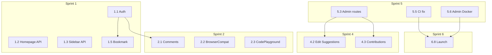

# ThaiDevDocs — Development Checklist & Sprint Plan

> อ้างอิงจาก `thai-developer-docs-spec.md` v1.0  
> สถานะโปรเจค ณ มิ.ย. 2026: **~65–70% โครงสร้าง / ~45–50% end-to-end**

**สัญลักษณ์**
- ✅ ทำแล้ว / ใช้งานได้
- 🟡 มีแล้วแต่ยังไม่ครบ (stub, hardcoded, ไม่ได้ wire)
- ❌ ยังไม่มี
- ⏭️ Phase 2 ตาม spec (ไม่จำเป็นสำหรับ MVP)

---

## 1. Checklist รายไฟล์

### 1.1 Backend — Database Migrations (26 ไฟล์)

| ไฟล์ | ตาราง | สถานะ |
|------|-------|--------|
| `0001_01_01_000000_create_users_table.php` | users, sessions, password_reset | ✅ |
| `0001_01_01_000001_create_cache_table.php` | cache | ✅ |
| `0001_01_01_000002_create_jobs_table.php` | jobs, failed_jobs | ✅ |
| `2024_01_01_000003_create_user_preferences_table.php` | user_preferences | ✅ |
| `2024_01_01_000004_create_categories_table.php` | categories | ✅ |
| `2024_01_01_000005_create_topics_table.php` | topics | ✅ |
| `2024_01_01_000006_create_articles_table.php` | articles | ✅ |
| `2024_01_01_000007_create_article_revisions_table.php` | article_revisions | ✅ |
| `2024_01_01_000008_create_code_examples_table.php` | code_examples | ✅ |
| `2024_01_01_000009_create_interactive_demos_table.php` | interactive_demos | ✅ |
| `2024_01_01_000010_create_tags_table.php` | tags, article_tags | ✅ |
| `2024_01_01_000011_create_related_articles_table.php` | related_articles | ✅ |
| `2024_01_01_000012_create_collections_table.php` | collections | ✅ |
| `2024_01_01_000013_create_bookmarks_table.php` | bookmarks | ✅ |
| `2024_01_01_000014_create_reading_history_table.php` | reading_history | ✅ |
| `2024_01_01_000015_create_article_ratings_table.php` | article_ratings | ✅ |
| `2024_01_01_000016_create_comments_table.php` | comments, comment_votes | ✅ |
| `2024_01_01_000017_create_contributions_table.php` | contributions, edit_suggestions | ✅ |
| `2024_01_01_000018_create_glossary_table.php` | glossary | ✅ |
| `2024_01_01_000019_create_browsers_table.php` | browsers, browser_compatibility | ✅ |
| `2024_01_01_000020_create_search_logs_table.php` | search_logs, page_views | ✅ |
| `2024_01_01_000021_create_settings_table.php` | settings | ✅ |
| `2024_01_01_000022_create_media_table.php` | media | ✅ |
| `2024_01_01_000023_create_notifications_table.php` | notifications | ✅ |
| `2024_01_01_000024_create_learning_paths_table.php` | learning_paths, items, progress | ✅ |
| `2024_01_01_000026_create_personal_access_tokens_table.php` | sanctum tokens | ✅ |

---

### 1.2 Backend — API Controllers

#### Public API (`/api/v1`)

| Controller | Endpoints หลัก | สถานะ |
|------------|----------------|--------|
| `Api/AuthController.php` | register, login, logout, refresh, forgot/reset password, social | ✅ (social ต้อง config OAuth env) |
| `Api/CategoryController.php` | list, show, topics | ✅ |
| `Api/TopicController.php` | show, articles | ✅ |
| `Api/ArticleController.php` | CRUD read, related, revisions, examples, compatibility, rate, feedback, suggest-edit | ✅ |
| `Api/TagController.php` | list, show, articles | ✅ |
| `Api/SearchController.php` | search, suggestions, popular | ✅ |
| `Api/BookmarkController.php` | CRUD bookmarks, status | ✅ |
| `Api/CollectionController.php` | CRUD collections + articles | ✅ |
| `Api/UserController.php` | profile, preferences, password, history, contributions | ✅ |
| `Api/CommentController.php` | CRUD comments, vote | ✅ |
| `Api/LearningPathController.php` | list, show, enroll, progress, my-learning | ✅ |
| `Api/GlossaryController.php` | list, show, search | ✅ |

#### Admin API (`/api/v1/admin`)

| Controller | สถานะ | หมายเหตุ |
|------------|--------|----------|
| `Admin/DashboardController.php` | ✅ | stats, charts, recent-activity |
| `Admin/ArticleController.php` | ✅ | CRUD, publish, duplicate |
| `Admin/CategoryController.php` | ✅ | reorder |
| `Admin/TopicController.php` | ✅ | reorder |
| `Admin/TagController.php` | ✅ | merge |
| `Admin/UserController.php` | ✅ | role, ban |
| `Admin/CommentController.php` | ✅ | pending, approve, reject |
| `Admin/MediaController.php` | ✅ | upload, delete |
| `Admin/SettingsController.php` | ✅ | super_admin only |
| `Admin/AnalyticsController.php` | ✅ | overview, articles, search, users |
| `Admin/EditSuggestionController.php` | ❌ | spec: GET/PATCH edit-suggestions |
| `Admin/ContributionController.php` | ❌ | spec: GET contributions/pending, review |
| `Admin/LearningPathController.php` | ❌ | spec: CRUD learning paths (admin) |
| `Admin/GlossaryController.php` | ❌ | spec: CRUD glossary (admin) |

---

### 1.3 Backend — Models, Commands, Tests

| ไฟล์/กลุ่ม | สถานะ | หมายเหตุ |
|-----------|--------|----------|
| Models (Article, User, Comment, …) | ✅ | ครบตาม migrations |
| `Article.php` Scout/Searchable | ✅ | |
| `Glossary.php` Scout/Searchable | ✅ | |
| `Console/Commands/GenerateSitemap.php` | ✅ | |
| `Console/Commands/ConfigureMeilisearch.php` | ❌ | spec Section 8.2 |
| `Console/Commands/UpdateArticleViewCounts.php` | ❌ | schedule ใน console.php แต่ไม่มี command |
| `Console/Commands/CleanupSearchLogs.php` | ❌ | schedule แต่ไม่มี command |
| `Console/Commands/SendWeeklyDigest.php` | ❌ | schedule แต่ไม่มี command |
| `tests/Feature/AuthTest.php` | ✅ | |
| `tests/Feature/ArticleTest.php` | ✅ | |
| `tests/Feature/BookmarkTest.php` | ✅ | |
| Tests อื่น (Search, Comment, LearningPath, Admin…) | ❌ | |
| Swagger / OpenAPI docs | ❌ | README อ้าง `/api/documentation` |
| Email verification endpoints | 🟡 | User implements MustVerifyEmail แต่ไม่มี verify/resend route |
| Horizon dashboard config | 🟡 | package ติดตั้งแล้ว ต้อง verify production setup |

---

### 1.4 Frontend — Pages (เทียบ spec Section 6.1)

| ไฟล์ spec | ไฟล์จริง | สถานะ |
|-----------|----------|--------|
| `pages/index.vue` | ✅ มี | 🟡 categories/articles hardcoded (TODO API) |
| `pages/search.vue` | ✅ มี | ✅ เชื่อม API |
| `pages/docs/index.vue` | ❌ | ไม่มี — ใช้ `[...slug].vue` อย่างเดียว |
| `pages/docs/[...slug].vue` | ✅ มี | 🟡 fetch API ได้ แต่ bookmark/feedback TODO, ไม่มี comments/compat |
| `pages/learn/index.vue` | ✅ มี | ✅ เชื่อม API |
| `pages/learn/[slug].vue` | ✅ มี | 🟡 ตรวจสอบ enroll/progress wiring |
| `pages/glossary/index.vue` | ❌ | API พร้อม |
| `pages/glossary/[term].vue` | ❌ | API พร้อม |
| `pages/auth/login.vue` | ✅ มี | ✅ ใช้ useAuth |
| `pages/auth/register.vue` | ✅ มี | 🟡 ตรวจสอบ error handling |
| `pages/auth/forgot-password.vue` | ❌ | API พร้อม |
| `pages/user/profile.vue` | ✅ มี | 🟡 ตรวจสอบ API wiring |
| `pages/user/bookmarks.vue` | ✅ มี | 🟡 มี collections inline |
| `pages/user/collections.vue` | ❌ | spec แยกหน้า — ตอนนี้รวมใน bookmarks |
| `pages/user/settings.vue` | ❌ | ใช้ `preferences.vue` แทน |
| `pages/user/history.vue` | ✅ มี | 🟡 |
| `pages/user/contributions.vue` | ✅ มี | 🟡 |

---

### 1.5 Frontend — Components

| ไฟล์ spec | ไฟล์จริง | สถานะ |
|-----------|----------|--------|
| `common/AppHeader.vue` | ✅ | 🟡 `isAuthenticated` hardcoded TODO |
| `common/AppFooter.vue` | ✅ | ✅ |
| `common/AppSidebar.vue` | ❌ | ใช้ `docs/DocsSidebar.vue` แทน |
| `common/SearchModal.vue` | ✅ | 🟡 ตรวจ suggestions API |
| `common/ThemeToggle.vue` | ✅ | ✅ |
| `common/BreadcrumbNav.vue` | ❌ | breadcrumb inline ใน article page |
| `common/UserMenu.vue` | ✅ | 🟡 logout TODO |
| `article/ArticleContent.vue` | ✅ | ✅ |
| `article/ArticleToc.vue` | ❌ | ใช้ `docs/DocsToc.vue` |
| `article/ArticleMeta.vue` | ❌ | meta inline ใน page |
| `article/ArticleNavigation.vue` | ❌ | prev/next article |
| `article/ArticleRating.vue` | ❌ | rating inline ใน page |
| `article/CodeBlock.vue` | ✅ | ✅ |
| `article/CodePlayground.vue` | ✅ | ❌ **มีไฟล์แต่ไม่ได้ import ใช้** |
| `article/BrowserCompat.vue` | ❌ | API `/compatibility` พร้อม |
| `article/RelatedArticles.vue` | ❌ | logic ใน page + ArticleCard |
| `article/CommentSection.vue` | ✅ | ❌ **มีไฟล์แต่ไม่ได้ import ใช้** |
| `article/CommentItem.vue` | ✅ | ❌ ไม่ได้ใช้ |
| `article/ArticleCard.vue` | ✅ | ✅ |
| `search/SearchInput.vue` | ❌ | logic ใน search.vue |
| `search/SearchResults.vue` | ❌ | logic ใน search.vue |
| `search/SearchFilters.vue` | ❌ | logic ใน search.vue |
| `search/SearchSuggestions.vue` | ❌ | logic ใน SearchModal |
| `user/BookmarkButton.vue` | ❌ | inline ใน article page |
| `user/ProgressTracker.vue` | ❌ | |
| `ui/BaseButton.vue` … | ❌ | ใช้ Tailwind utility classes ตรงๆ |

---

### 1.6 Frontend — Composables, Stores, Layouts

| ไฟล์ spec | ไฟล์จริง | สถานะ |
|-----------|----------|--------|
| `composables/useAuth.ts` | ✅ | ✅ |
| `composables/useApi.ts` | ✅ | ✅ |
| `composables/useSearch.ts` | ❌ | |
| `composables/useBookmarks.ts` | ❌ | มี stores/bookmarks.ts บางส่วน |
| `composables/useTheme.ts` | ❌ | ใช้ @nuxtjs/color-mode |
| `composables/useToast.ts` | ❌ | |
| `composables/useKeyboardShortcuts.ts` | ❌ | ⌘K search อาจมีบางส่วน |
| `stores/auth.ts` | ✅ | ✅ |
| `stores/bookmarks.ts` | ✅ | 🟡 |
| `stores/search.ts` | ❌ | |
| `stores/preferences.ts` | ❌ | |
| `stores/navigation.ts` | ❌ | |
| `layouts/default.vue` | ✅ | ✅ |
| `layouts/docs.vue` | ✅ | 🟡 DocsSidebar hardcoded |
| `layouts/auth.vue` | ❌ | login ใช้ layout: false |
| `middleware/auth.ts` | ✅ | ✅ |
| `types/*.ts` | 🟡 | มี types/index.ts รวม |
| Frontend tests | ❌ | ไม่มี test script ใน package.json |

---

### 1.7 Admin Panel

| View / ไฟล์ | สถานะ | หมายเหตุ |
|-------------|--------|----------|
| `DashboardView.vue` | ✅ | |
| `articles/ArticleListView.vue` | ✅ | |
| `articles/ArticleEditorView.vue` | ✅ | Markdown editor, preview, media |
| `categories/CategoryListView.vue` | ✅ | |
| `topics/TopicListView.vue` | ✅ | |
| `tags/TagListView.vue` | ✅ | |
| `users/UserListView.vue` | ✅ | |
| `comments/CommentListView.vue` | ✅ | |
| `media/MediaLibraryView.vue` | ✅ | |
| `analytics/AnalyticsView.vue` | ✅ | |
| `settings/SettingsView.vue` | ✅ | super_admin |
| `auth/LoginView.vue` | ✅ | |
| `learning-paths/*` | ❌ | ไม่มี route/view |
| `contributions/*` | ❌ | review pending contributions |
| `edit-suggestions/*` | ❌ | review edit suggestions |
| `glossary/*` | ❌ | CRUD glossary |
| Version history UI | ❌ | API revisions มี |
| Schedule publish UI | ❌ | |
| Bulk operations UI | ❌ | |
| Drag & drop reorder UI | 🟡 | API reorder มี |

---

### 1.8 DevOps & Infrastructure

| รายการ | สถานะ | หมายเหตุ |
|--------|--------|----------|
| `backend/docker-compose.yml` | ✅ | dev services |
| `docker-compose.prod.yml` | ✅ | |
| `backend/Dockerfile` | ✅ | |
| `backend/Dockerfile.prod` | ✅ | |
| `frontend/Dockerfile.prod` | ✅ | |
| `admin/Dockerfile.prod` | ✅ | nginx static serve |
| `docker/nginx/*` | ✅ | |
| `.github/workflows/ci.yml` | ✅ | trigger push main + develop |
| `.github/workflows/deploy.yml` | ✅ | includes meilisearch:configure |
| `DEPLOYMENT.md` | ✅ | |
| `database/seeders/DatabaseSeeder.php` | ✅ | 25 บทความ + glossary + paths |
| Learning path / Glossary seeders | ✅ | `LearningPathSeeder`, `GlossarySeeder`, `BrowserSeeder` |
| Content migration scripts | ❌ | Phase 4 |

---

### 1.9 Security Checklist (Spec Section 12.1)

| รายการ | สถานะ |
|--------|--------|
| HTTPS / SSL | 🟡 nginx config มี placeholder |
| CSRF (Sanctum SPA) | 🟡 |
| XSS (sanitize markdown) | 🟡 ตรวจ ArticleContent rendering |
| SQL injection (Eloquent) | ✅ |
| Rate limiting | 🟡 ตรวจ RouteServiceProvider / middleware |
| Input validation | ✅ ส่วนใหญ่ |
| File upload validation | 🟡 MediaController |
| Admin IP restriction | ❌ optional |
| Two-factor auth (admin) | ❌ |
| Dependency scanning (CI) | ❌ |
| Backup encryption | ❌ |

---

## 2. Sprint Plan — ปิดงานที่เหลือ (6 Sprints × 1 สัปดาห์)

> ประมาณ **6 สัปดาห์** สำหรับ 1 developer full-time  
> ปรับลด/ขยายได้ตามทีม

---

### Sprint 1 — Frontend Integration (Phase 1 ปิด + MVP Should-Have)

**เป้าหมาย:** หน้าเว็บใช้งานได้จริง end-to-end โดยไม่มี hardcoded data

| # | งาน | ไฟล์ที่ต้องแก้/สร้าง | Priority |
|---|-----|---------------------|----------|
| 1.1 | เชื่อม auth state ทั้งแอป | `AppHeader.vue`, `UserMenu.vue`, `app.vue` (init auth) | 🔴 |
| 1.2 | Homepage ดึง categories + featured/popular articles จาก API | `pages/index.vue` | 🔴 |
| 1.3 | DocsSidebar ดึง categories/topics จาก API | `DocsSidebar.vue`, `layouts/docs.vue` | 🔴 |
| 1.4 | สร้าง `pages/docs/index.vue` (overview หมวดหมู่) | ใหม่ | 🔴 |
| 1.5 | Wire bookmark + feedback ในหน้า article | `pages/docs/[...slug].vue`, `stores/bookmarks.ts` | 🔴 |
| 1.6 | บันทึก reading history เมื่อเปิดบทความ | `pages/docs/[...slug].vue` | 🟡 |
| 1.7 | สร้าง `pages/auth/forgot-password.vue` | ใหม่ | 🟡 |
| 1.8 | สร้าง `layouts/auth.vue` ใช้ร่วม login/register/forgot | ใหม่ + แก้ auth pages | 🟡 |

**Definition of Done Sprint 1**
- [ ] Login/logout ทำงานและ header แสดงสถานะถูกต้อง
- [ ] Homepage + sidebar แสดงข้อมูลจาก API
- [ ] Bookmark/feedback เรียก API จริง
- [ ] ไม่มี `// TODO: Fetch from API` ในไฟล์หลัก 3 ไฟล์ข้างต้น

---

### Sprint 2 — Article Experience (Phase 2 ปิด)

**เป้าหมาย:** หน้าบทความครบตาม spec wireframe

| # | งาน | ไฟล์ที่ต้องแก้/สร้าง | Priority |
|---|-----|---------------------|----------|
| 2.1 | Wire CommentSection ในหน้า article | `pages/docs/[...slug].vue`, `CommentSection.vue` | ✅ |
| 2.2 | สร้าง BrowserCompat component + แสดง compatibility | `components/article/BrowserCompat.vue`, article page | ✅ |
| 2.3 | Wire CodePlayground สำหรับ runnable examples | `CodePlayground.vue`, article page | ✅ |
| 2.4 | Article prev/next navigation | `ArticleNavigation.vue` (ใหม่) | ✅ |
| 2.5 | แยก/ปรับ ArticleMeta, ArticleRating | components ใหม่ | ✅ |
| 2.6 | สร้าง composables: `useBookmarks`, `useSearch` | composables/ | ✅ |
| 2.7 | SEO: meta tags, structured data, sitemap link | `nuxt.config.ts`, article page | ✅ |

**Definition of Done Sprint 2**
- [x] แสดง comments, browser compat, code playground ในหน้าบทความ
- [x] Rate article ทำงานผ่าน API
- [x] Related articles แสดงจาก API (มีแล้ว — verify)

---

### Sprint 3 — Glossary, Learning & User Area (Phase 3 ปิด)

**เป้าหมาย:** ฟีเจอร์ชุมชน/การเรียนรู้ครบฝั่ง user

| # | งาน | ไฟล์ที่ต้องแก้/สร้าง | Priority |
|---|-----|---------------------|----------|
| 3.1 | สร้าง Glossary pages | `pages/glossary/index.vue`, `[term].vue` | ✅ |
| 3.2 | Verify + ปรับ Learning path enroll/progress | `learn/index.vue`, `learn/[slug].vue` | ✅ |
| 3.3 | สร้าง ProgressTracker component | `components/user/ProgressTracker.vue` | ✅ |
| 3.4 | ปรับ user profile/preferences ให้เชื่อม API ครบ | `profile.vue`, `preferences.vue` | ✅ |
| 3.5 | Suggest edit จากหน้าบทความ (contributor) | modal + article page | ✅ |
| 3.6 | สร้าง `stores/preferences.ts` + sync theme | stores + ThemeToggle | ✅ |
| 3.7 | Keyboard shortcut ⌘K search | `useKeyboardShortcuts.ts` | ✅ |

**Definition of Done Sprint 3**
- [x] Glossary browse + search ใช้งานได้
- [x] Enroll learning path + ติดตาม progress
- [x] User preferences บันทึกลง API

---

### Sprint 4 — Admin Completion

**เป้าหมาย:** CMS ครบตาม spec Section 7.4

| # | งาน | ไฟล์ที่ต้องแก้/สร้าง | Priority |
|---|-----|---------------------|----------|
| 4.1 | Admin LearningPathController + views | backend controller, `admin/views/learning-paths/*`, router | 🔴 |
| 4.2 | Admin EditSuggestionController + review UI | backend + `admin/views/edit-suggestions/*` | 🔴 |
| 4.3 | Admin ContributionController + pending review | backend + `admin/views/contributions/*` | 🔴 |
| 4.4 | Admin GlossaryController + CRUD UI | backend + admin views | 🟡 |
| 4.5 | Version history viewer ใน ArticleEditor | `ArticleEditorView.vue` | 🟡 |
| 4.6 | Schedule publish + bulk actions | ArticleListView + backend | 🟡 |
| 4.7 | Drag & drop reorder categories/topics | admin list views | 🟢 |

**Definition of Done Sprint 4**
- [x] Admin จัดการ learning paths, glossary ได้
- [x] Editor review edit suggestions + contributions ได้
- [x] Routes ใหม่ใน `admin/src/router/index.ts`

---

### Sprint 5 — Backend Polish & DevOps

**เป้าหมาย:** scheduled jobs, search, CI/CD, production-ready infra

| # | งาน | ไฟล์ที่ต้องแก้/สร้าง | Priority |
|---|-----|---------------------|----------|
| 5.1 | สร้าง Artisan commands ที่ schedule ไว้ | `UpdateArticleViewCounts`, `CleanupSearchLogs`, `SendWeeklyDigest` | 🔴 |
| 5.2 | สร้าง ConfigureMeilisearch command | ตาม spec Section 8.2 | 🔴 |
| 5.3 | เพิ่ม admin routes: edit-suggestions, contributions | `routes/api.php` | 🔴 |
| 5.4 | Email verification routes + notification | AuthController, routes | 🟡 |
| 5.5 | ย้าย CI กลับ `.github/workflows/` | ci.yml, deploy.yml | 🔴 |
| 5.6 | สร้าง `admin/Dockerfile.prod` | ใหม่ | 🔴 |
| 5.7 | Rate limiting middleware | `bootstrap/app.php` หรือ RouteServiceProvider | 🟡 |
| 5.8 | Swagger/OpenAPI หรือลบ mention ออกจาก README | เลือกอย่างใดอย่างหนึ่ง | 🟡 |

**Definition of Done Sprint 5**
- [x] `php artisan schedule:list` ไม่มี broken commands
- [x] GitHub Actions CI รันบน push/PR
- [x] `docker-compose -f docker-compose.prod.yml up --build` สำเร็จ (admin Dockerfile.prod เพิ่มแล้ว)

---

### Sprint 6 — Testing, Content & Launch (Phase 4)

**เป้าหมาย:** พร้อม launch จริง

| # | งาน | ไฟล์ที่ต้องแก้/สร้าง | Priority |
|---|-----|---------------------|----------|
| 6.1 | Backend tests เพิ่ม: Search, Comment, LearningPath, Admin | `tests/Feature/*` | 🔴 |
| 6.2 | E2E smoke tests (optional: Playwright) | `frontend/` หรือ root | 🟡 |
| 6.3 | Seeders: learning paths, glossary, browser data | `database/seeders/*` | 🔴 |
| 6.4 | Seed เนื้อหาเริ่มต้นตาม Appendix 13.1 (อย่างน้อย HTML/CSS/JS basics) | seeders หรือ markdown import | 🔴 |
| 6.5 | Performance: cache response, image optimization | backend middleware, nuxt image | 🟡 |
| 6.6 | Security audit checklist | ตาม Section 12 | 🟡 |
| 6.7 | อัปเดต README + DEPLOYMENT ให้ตรงความจริง | docs | 🟡 |
| 6.8 | Launch checklist: env vars, SSL, backup strategy | DEPLOYMENT.md | 🔴 |

**Definition of Done Sprint 6 (Launch Ready)**
- [x] Test suite พร้อมรันใน CI (Search, Comment, LearningPath, Admin + TestCase/phpunit.xml)
- [x] เนื้อหา demo ≥ 25 บทความ (HTML/CSS/JS/Web APIs)
- [x] Launch checklist ใน DEPLOYMENT.md
- [x] Security checklist ≥ 80% (`SECURITY.md`)

---

## 3. Quick Reference

> ตารางอ้างอิงด่วน — เรียงตามลำดับที่ควรทำ  
> **อัปเดตล่าสุด:** มิ.ย. 2026 · **ความคืบหน้ารวม:** 8 / 45 tasks (18%)

### 3.1 สรุปความคืบหน้า (Dashboard)

| Sprint | ชื่อ | Tasks | เสร็จ | % | สถานะ |
|--------|------|-------|------|---|--------|
| S1 | Frontend Integration | 8 | 8 | 100% | ✅ เสร็จแล้ว |
| S2 | Article Experience | 7 | 7 | 100% | ✅ เสร็จแล้ว |
| S3 | Glossary & Learning | 7 | 7 | 100% | ✅ เสร็จแล้ว |
| S4 | Admin Completion | 7 | 7 | 100% | ✅ เสร็จ |
| S5 | Backend & DevOps | 8 | 8 | 100% | ✅ เสร็จ |
| S6 | Testing & Launch | 8 | 7 | 88% | ✅ เสร็จ (6.2 optional) |
| **รวม** | | **45** | **44** | **98%** | |

**Milestones**

| Milestone | Sprint ที่ต้องเสร็จ | สถานะ | เป้าหมาย |
|-----------|-------------------|--------|----------|
| M1 — MVP ใช้งานได้ | S1 | ✅ | Auth + หน้าเว็บดึง API จริง |
| M2 — Beta Launch | S1 + S2 + S5 | 🟡 | บทความครบ + CI/Docker พร้อม |
| M3 — Feature Complete | S1–S4 | ✅ | CMS + Community ครบ spec |
| M4 — Production Launch | S1–S6 | 🟡 | Tests + Content + Security |

### 3.2 ลำดับความสำคัญ (Priority Tiers)

#### 🔴 P0 — Blockers (ทำก่อน ไม่มีแล้ว launch ไม่ได้)

| ID | งาน | Sprint | Layer | ขึ้นกับ |
|----|-----|--------|-------|---------|
| 1.1 | Auth state ทั้งแอป | S1 | Frontend | — |
| 1.2 | Homepage จาก API | S1 | Frontend | — |
| 1.3 | DocsSidebar จาก API | S1 | Frontend | — |
| 1.5 | Bookmark + feedback ในหน้า article | S1 | Frontend | 1.1 |
| 2.1 | Wire CommentSection | S2 | Frontend | 1.1 |
| 2.2 | BrowserCompat component | S2 | Frontend | — |
| 2.3 | Wire CodePlayground | S2 | Frontend | — |
| 4.1 | Admin Learning Paths | S4 | Admin+BE | — |
| 4.2 | Admin Edit Suggestions | S4 | Admin+BE | 5.3 |
| 4.3 | Admin Contributions review | S4 | Admin+BE | 5.3 |
| 5.1 | Artisan scheduled commands | S5 | Backend | — |
| 5.3 | Admin routes edit-suggestions / contributions | S5 | Backend | — |
| 5.5 | ย้าย CI → `.github/workflows/` | S5 | DevOps | — |
| 5.6 | `admin/Dockerfile.prod` | S5 | DevOps | — |
| 6.4 | Seed เนื้อหา HTML/CSS/JS basics | S6 | Content | — |
| 6.8 | Launch checklist (env, SSL, backup) | S6 | DevOps | 5.5, 5.6 |

#### 🟡 P1 — Important (ควรมีก่อน launch เต็มรูปแบบ)

| ID | งาน | Sprint | Layer |
|----|-----|--------|-------|
| 1.4 | `pages/docs/index.vue` | S1 | Frontend |
| 1.6 | Reading history auto-record | S1 | Frontend |
| 1.7 | Forgot password page | S1 | Frontend |
| 1.8 | `layouts/auth.vue` | S1 | Frontend |
| 2.4–2.7 | Article nav, meta, composables, SEO | S2 | Frontend |
| 3.1 | Glossary pages | S3 | Frontend |
| 3.2 | Learning path enroll/progress | S3 | Frontend |
| 3.4–3.6 | Profile, preferences, suggest edit | S3 | Frontend |
| 4.4–4.6 | Admin glossary, version history, schedule publish | S4 | Admin |
| 5.2 | ConfigureMeilisearch command | S5 | Backend |
| 5.4 | Email verification flow | S5 | Backend |
| 5.7–5.8 | Rate limiting, Swagger/README fix | S5 | Backend |
| 6.1 | Backend tests ขยาย | S6 | Backend |
| 6.3 | Seeders (paths, glossary, browsers) | S6 | Backend |
| 6.5–6.7 | Performance, security, docs update | S6 | Mixed |

#### 🟢 P2 — Nice to have (หลัง launch ได้)

| ID | งาน | Sprint | หมายเหตุ |
|----|-----|--------|----------|
| 3.7 | Keyboard shortcut ⌘K | S3 | UX enhancement |
| 4.7 | Drag & drop reorder UI | S4 | API มีแล้ว |
| 6.2 | E2E Playwright tests | S6 | Optional |
| — | UI component library (BaseButton ฯลฯ) | — | ไม่อยู่ใน sprint plan |
| — | 2FA admin | — | Spec Section 12 |
| — | Premium: offline, AI help | — | Phase 2 spec ⏭️ |

### 3.3 ตารางงานทั้งหมด (Master Task List)

| ID | งาน | Sprint | Pri | Layer | Est. | Dep | Status |
|----|-----|--------|-----|-------|------|-----|--------|
| 1.1 | Auth state ทั้งแอป | S1 | FE | 4h | — | ✅ |
| 1.2 | Homepage fetch categories + articles | S1 | FE | 3h | — | ✅ |
| 1.3 | DocsSidebar fetch จาก API | S1 | FE | 3h | — | ✅ |
| 1.4 | สร้าง `pages/docs/index.vue` | S1 | FE | 2h | 1.3 | ✅ |
| 1.5 | Wire bookmark + feedback ใน article | S1 | FE | 3h | 1.1 | ✅ |
| 1.6 | Auto-record reading history | S1 | FE | 2h | 1.1 | ✅ |
| 1.7 | สร้าง forgot-password page | S1 | FE | 2h | — | ✅ |
| 1.8 | สร้าง `layouts/auth.vue` | S1 | FE | 1h | — | ✅ |
| 2.1 | Wire CommentSection ใน article | S2 | ✅ | FE | 4h | 1.1 | ✅ |
| 2.2 | สร้าง BrowserCompat + แสดงผล | S2 | ✅ | FE | 3h | — | ✅ |
| 2.3 | Wire CodePlayground | S2 | ✅ | FE | 3h | — | ✅ |
| 2.4 | Article prev/next navigation | S2 | ✅ | FE | 2h | — | ✅ |
| 2.5 | ArticleMeta + ArticleRating components | S2 | ✅ | FE | 2h | — | ✅ |
| 2.6 | Composables useBookmarks, useSearch | S2 | ✅ | FE | 3h | 1.5 | ✅ |
| 2.7 | SEO meta + structured data | S2 | ✅ | FE | 3h | — | ✅ |
| 3.1 | Glossary index + term pages | S3 | ✅ | FE | 4h | — | ✅ |
| 3.2 | Learning path enroll + progress | S3 | ✅ | FE | 4h | 1.1 | ✅ |
| 3.3 | ProgressTracker component | S3 | ✅ | FE | 2h | 3.2 | ✅ |
| 3.4 | Profile + preferences API wiring | S3 | ✅ | FE | 3h | 1.1 | ✅ |
| 3.5 | Suggest edit modal ในหน้า article | S3 | ✅ | FE | 3h | 1.1 | ✅ |
| 3.6 | stores/preferences + theme sync | S3 | ✅ | FE | 2h | 3.4 | ✅ |
| 3.7 | useKeyboardShortcuts ⌘K | S3 | ✅ | FE | 1h | — | ✅ |
| 4.1 | Admin LearningPath CRUD | S4 | 🔴 | Admin+BE | 6h | — | ✅ |
| 4.2 | Admin EditSuggestion review | S4 | 🔴 | Admin+BE | 5h | 5.3 | ✅ |
| 4.3 | Admin Contribution review | S4 | 🔴 | Admin+BE | 4h | 5.3 | ✅ |
| 4.4 | Admin Glossary CRUD | S4 | 🟡 | Admin+BE | 4h | — | ✅ |
| 4.5 | Version history viewer | S4 | 🟡 | Admin | 4h | — | ✅ |
| 4.6 | Schedule publish + bulk actions | S4 | 🟡 | Admin+BE | 5h | — | ✅ |
| 4.7 | Drag & drop reorder UI | S4 | 🟢 | Admin | 4h | — | ✅ |
| 5.1 | Artisan: view-counts, cleanup-logs, digest | S5 | 🔴 | BE | 4h | — | ✅ |
| 5.2 | ConfigureMeilisearch command | S5 | 🟡 | BE | 2h | — | ✅ |
| 5.3 | Admin routes edit-suggestions, contributions | S5 | 🔴 | BE | 3h | — | ✅ |
| 5.4 | Email verification routes | S5 | 🟡 | BE | 3h | — | ✅ |
| 5.5 | ย้าย CI → `.github/workflows/` | S5 | 🔴 | DevOps | 1h | — | ✅ |
| 5.6 | สร้าง admin/Dockerfile.prod | S5 | 🔴 | DevOps | 2h | — | ✅ |
| 5.7 | Rate limiting middleware | S5 | 🟡 | BE | 2h | — | ✅ |
| 5.8 | Swagger หรือแก้ README | S5 | 🟡 | Docs | 2h | — | ✅ |
| 6.1 | Backend tests ขยาย | S6 | 🔴 | BE | 8h | — | ✅ |
| 6.2 | E2E smoke tests (Playwright) | S6 | 🟢 | Test | 6h | M2 | ⏭️ |
| 6.3 | Seeders paths, glossary, browsers | S6 | 🔴 | BE | 4h | 4.1, 4.4 | ✅ |
| 6.4 | Seed เนื้อหา ≥20 บทความ | S6 | 🔴 | Content | 16h+ | — | ✅ |
| 6.5 | Performance tuning | S6 | 🟡 | Mixed | 4h | — | ✅ |
| 6.6 | Security audit checklist | S6 | 🟡 | Mixed | 4h | 5.7 | ✅ |
| 6.7 | อัปเดต README + DEPLOYMENT | S6 | 🟡 | Docs | 2h | — | ✅ |
| 6.8 | Launch checklist staging | S6 | 🔴 | DevOps | 4h | 5.5, 5.6 | ✅ |

**Est. รวม:** ~140–160 ชม. (~4 สัปดาห์ full-time หรือ 6 สัปดาห์ part-time)

### 3.4 แผน Beta Launch เร็ว (3 สัปดาห์)

```
Week 1 → Sprint 1 (1.1–1.5 ก่อน)     → M1 MVP ใช้งานได้
Week 2 → Sprint 2 (2.1–2.3 ก่อน)     → บทความครบฟีเจอร์หลัก
Week 3 → Sprint 5 (5.1, 5.3, 5.5, 5.6) → M2 Beta Launch
         + 6.4 เนื้อหาขั้นต่ำ
```

### 3.5 Dependency Flow



### 3.6 ค้นหางานตาม Layer

| Layer | Task IDs | จำนวน |
|-------|----------|-------|
| **Frontend** | 1.1–1.8, 2.1–2.7, 3.1–3.7 | 22 |
| **Admin** | 4.1–4.7 | 7 |
| **Backend** | 5.1–5.4, 5.7, 6.1, 6.3 | 8 |
| **DevOps** | 5.5, 5.6, 6.8 | 3 |
| **Content** | 6.4 | 1 |
| **Mixed/Docs/Test** | 5.8, 6.2, 6.5–6.7 | 4 |

---

## 4. Progress Tracker

> ติ๊ก `[x]` เมื่องานเสร็จ · อัปเดตตาราง 3.1 ด้วย (เสร็จ / %)

### 4.1 Sprint Summary

| Sprint | Progress | Bar |
|--------|----------|-----|
| S1 Frontend Integration | 8 / 8 | `██████████` 100% |
| S2 Article Experience | 7 / 7 | `██████████` 100% |
| S3 Glossary & Learning | 7 / 7 | `██████████` 100% |
| S4 Admin Completion | 7 / 7 | `██████████` 100% |
| S5 Backend & DevOps | 8 / 8 | `██████████` 100% |
| S6 Testing & Launch | 7 / 8 | `█████████░` 88% |
| **TOTAL** | **44 / 45** | `█████████░` **98%** |

### 4.2 Sprint 1 — Frontend Integration (8/8) ✅

- [x] **1.1** Auth state — `AppHeader.vue`, `UserMenu.vue`, `app.vue`
- [x] **1.2** Homepage API — `pages/index.vue`
- [x] **1.3** DocsSidebar API — `components/docs/DocsSidebar.vue`
- [x] **1.4** Docs overview — `pages/docs/index.vue` *(new)*
- [x] **1.5** Bookmark + feedback — `pages/docs/[...slug].vue`
- [x] **1.6** Reading history auto-record
- [x] **1.7** Forgot password — `pages/auth/forgot-password.vue` *(new)*
- [x] **1.8** Auth layout — `layouts/auth.vue` *(new)*

**DoD Sprint 1**
- [x] Login/logout + header แสดงสถานะถูกต้อง
- [x] Homepage + sidebar จาก API (ไม่มี hardcoded)
- [x] Bookmark/feedback เรียก API จริง

---

### 4.3 Sprint 2 — Article Experience (7/7) ✅

- [x] **2.1** Wire CommentSection — `[...slug].vue` + `CommentSection.vue`
- [x] **2.2** BrowserCompat component *(new)* + article page
- [x] **2.3** Wire CodePlayground — article page
- [x] **2.4** ArticleNavigation prev/next *(new)*
- [x] **2.5** ArticleMeta + ArticleRating *(new)*
- [x] **2.6** Composables — `useBookmarks.ts`, `useSearch.ts` *(new)*
- [x] **2.7** SEO — meta tags, structured data, sitemap

**DoD Sprint 2**
- [x] Comments, browser compat, code playground แสดงในหน้าบทความ
- [x] Rate article ผ่าน API
- [x] Related articles verify จาก API

---

### 4.4 Sprint 3 — Glossary & Learning (7/7) ✅

- [x] **3.1** Glossary pages — `pages/glossary/index.vue`, `[term].vue` *(new)*
- [x] **3.2** Learning path enroll/progress — `learn/*.vue`
- [x] **3.3** ProgressTracker — `components/user/ProgressTracker.vue` *(new)*
- [x] **3.4** Profile + preferences API — `user/profile.vue`, `preferences.vue`
- [x] **3.5** Suggest edit modal — article page
- [x] **3.6** `stores/preferences.ts` + theme sync
- [x] **3.7** `useKeyboardShortcuts.ts` — ⌘K search *(new)*

**DoD Sprint 3**
- [x] Glossary browse + search ใช้งานได้
- [x] Enroll learning path + ติดตาม progress
- [x] User preferences บันทึกลง API

---

### 4.5 Sprint 4 — Admin Completion (7/7)

- [x] **4.1** LearningPath admin — controller + `views/learning-paths/*` + router
- [x] **4.2** EditSuggestion review — controller + `views/edit-suggestions/*`
- [x] **4.3** Contribution review — controller + `views/contributions/*`
- [x] **4.4** Glossary admin CRUD
- [x] **4.5** Version history viewer — `ArticleEditorView.vue`
- [x] **4.6** Schedule publish + bulk actions
- [x] **4.7** Drag & drop reorder UI

**DoD Sprint 4**
- [x] Admin จัดการ learning paths + glossary
- [x] Review edit suggestions + contributions
- [x] Routes ใหม่ใน `admin/src/router/index.ts`

---

### 4.6 Sprint 5 — Backend & DevOps (8/8)

- [x] **5.1** Commands: `UpdateArticleViewCounts`, `CleanupSearchLogs`, `SendWeeklyDigest`
- [x] **5.2** `ConfigureMeilisearch` command (`meilisearch:configure`)
- [x] **5.3** Admin routes — edit-suggestions, contributions (Sprint 4)
- [x] **5.4** Email verification routes + `VerifyEmailNotification`
- [x] **5.5** CI workflows ใน `.github/workflows/` + trigger บน push `main`
- [x] **5.6** สร้าง `admin/Dockerfile.prod`
- [x] **5.7** Rate limiting — 60/120 req/min API, 10/min auth
- [x] **5.8** ลบ Swagger mention จาก README

**DoD Sprint 5**
- [x] Scheduled commands ครบใน `routes/console.php`
- [x] GitHub Actions CI รันบน push/PR
- [x] Production Docker artifacts พร้อม (admin Dockerfile.prod)

---

### 4.7 Sprint 6 — Testing & Launch (7/8)

- [x] **6.1** Backend tests — Search, Comment, LearningPath, Admin + test infra
- [ ] **6.2** E2E smoke tests (Playwright) *(optional — deferred)*
- [x] **6.3** Seeders — learning paths, glossary, browsers
- [x] **6.4** Seed เนื้อหา 25 บทความ (HTML/CSS/JS/Web APIs)
- [x] **6.5** Performance — `CachePublicApiResponse`, Nuxt Image config
- [x] **6.6** Security audit — `SECURITY.md` (~83%)
- [x] **6.7** อัปเดต README + DEPLOYMENT.md
- [x] **6.8** Launch checklist — env, SSL, backup, staging verify

**DoD Sprint 6 (Launch Ready)**
- [x] Test suite พร้อมใน CI
- [x] เนื้อหา demo ≥ 25 บทความ
- [x] Launch checklist + security ≥ 80%

---

### 4.8 Milestone Tracker

| Milestone | เงื่อนไข | สถานะ | วันที่เสร็จ |
|-----------|---------|--------|------------|
| M1 — MVP ใช้งานได้ | S1 DoD ครบ | ✅ | 2026-06-23 |
| M2 — Beta Launch | S1+S2+S5 DoD + 6.4 ขั้นต่ำ | ✅ | 2026-06-23 |
| M3 — Feature Complete | S1–S4 DoD ครบ | ✅ | 2026-06-23 |
| M4 — Production Launch | S1–S6 DoD ครบ | 🟡 | รอ staging deploy |

---

### 4.9 Changelog (บันทึกความคืบหน้า)

| วันที่ | Sprint | งานที่เสร็จ | หมายเหตุ |
|--------|--------|-------------|----------|
| 2026-06-23 | S1 | 1.7, 1.8 | Auth layout, forgot/reset password pages, guest middleware |
| 2026-06-23 | S1 | 1.6 | Reading history: useReadingHistory, scroll/time tracking, history page fix |
| 2026-06-23 | S1 | 1.5 | Article bookmark + feedback API, useBookmarks composable, slug fix |
| 2026-06-23 | S1 | 1.4 | Docs overview page `/docs` with categories, topics, stats |
| 2026-06-23 | S1 | 1.3 | DocsSidebar: useDocsNavigation composable, categories + topics from API |
| 2026-06-23 | S1 | 1.2 | Homepage: categories, featured/recent/popular articles, dynamic stats |
| 2026-06-23 | S1 | 1.1 | Auth state: useAuth + plugin init, AppHeader, UserMenu, app.vue |
| 2026-06-23 | S6 | 6.1–6.8 | Tests, seeders (25 articles), SECURITY.md, launch checklist, cache middleware |

<!-- ตัวอย่างการบันทึก:
| 2026-06-24 | S1 | 1.1, 1.2 | Auth + homepage เชื่อม API แล้ว |
-->

---

## 5. หมายเหตุ

- Spec Section 10.2 MVP **Should Have** (auth, bookmarks, dark mode, breadcrumb) — dark mode + breadcrumb มีแล้ว; auth/bookmarks ต้องปิดใน Sprint 1
- ไฟล์ `github/workflows/` ต้องย้ายกลับ `.github/workflows/` เพื่อให้ GitHub Actions ทำงาน
- ถ้าต้องการ launch เร็ว: ทำ Sprint 1 + 2 + 5 ก่อน (ประมาณ 3 สัปดาห์) แล้ว launch แบบ beta ขณะทำ Sprint 3–4–6 ต่อ

---

*สร้างจากการ audit โปรเจคเทียบ `thai-developer-docs-spec.md` — อัปเดต checklist นี้เมื่อ sprint แต่ละรอบเสร็จ*
